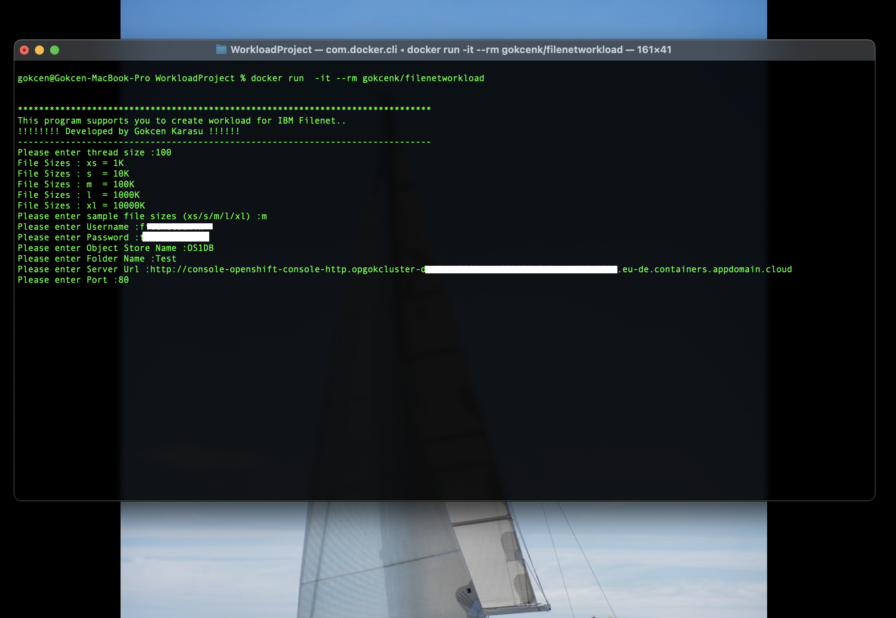

# Filenet Workload Creater

 
 
 
 
 


The aim of this repository is to create workload for Filenet on Kubernetes platform and traditional systems. 

> **Disclaimer:** If you are planning to use this standalone jar version please check your java version in your environment and please check the pre-requirements for your system.

<!-- vscode-markdown-toc -->

* 1.[Summary](#Summary)
* 2.[Java Code](#JavaCode)
* 3.[Product Versions](#ProductVersions)
* 4.[How to enable auto-scale feature for CPE pods on Openshift](#EnableAuto)
* 5.[Pre-Requirements](#PreRequirements)
* 6.[How to run container version](#RunContainer)
	* 6.1. [In Docker](#InDocker)
	* 6.2. [In Kubernetes](#InKubernetes)
	* 6.3. [In Openshift](#InOpenshift)
* 7.[How to run jar version](#RunJarVerison)

<!-- vscode-markdown-toc-config numbering=true autoSave=true /vscode-markdown-toc-config -->

<!-- /vscode-markdown-toc -->

##  1. <a name='Summary'></a>Summary

This asset is created to show how to auto scale IBM Filenet pods and network performance on Kubernetes (Openshift) platform or you can run it to create workload on traditional Filenet deployment.

There are two different options you can select: 
Runnable container version or standalone jar version.

If you want to see how to run auto scale Filenet pods in Openshift, you need to create manuel upload, read, review transactions at the same time, which is hard to run at the same time.
This program supports to you to create multiple files to upload your system at the same time by multi-thread features. 

You can select number of and size of the fies to upload though the program.

If you prefer to select using container version, you can enter the parameters when docker starts as enviortment parameters or after the container starts, the program asks you these parameters. 

There are 2 different options to use this program:
	
> * Fist one is container base system. 
> * Second one is Jar base system. 
	
Both of them are using the same java codes of which you can find the details below. 





##  2. <a name='JavaCode'></a>Java Code

*  I developed Javacode with 1.8 JDK in Eclipse development environment. 
 	
	There are 3 Classes to run this jar program. 
	
	** 1- ConnectionInfo = This is static abstraction class to be used for collecting data from user. 
	
	** 2- MultiThreadUpload = This includes runnable method and used to get some information from the user, and also it extends ConnectionInfo class. First it checks system enviorment to get parameters then it requires parameters from operators.
	It has time units sleep method to sleep thread until containers run. 
	`TimeUnit.SECONDS.sleep(6);`
	
	** 3- AddDocument = This is main class which was implemented Runnable class and includes has method upload and creat files.
	
```note
Please enter thread size :

File Sizes : xs = 1K
File Sizes : s  = 10K
File Sizes : m  = 100K
File Sizes : l  = 1000K
File Sizes : xl = 10000K
Please enter sample file sizes (xs/s/m/l/xl) :

Please enter Username :

Please enter Password :

Please enter Object Store Name :

Please enter Folder Name :

Please enter Server Url :

Please enter Port :
```
 
##  3. <a name='ProductVersions'></a>Product Versions
	
This is 1.4 version of the program. 
	
I used Java 1.8 so If you are planning to use this standalone jar version please check your java version in your environment. If you want to use container version of the program, you need to have at least one of these platforms: Docker, Podman, Kubernetes or Openshift. Please check kubernetes client version, it must be min 1.10 version to run the kubectl codes below correctly.

##  4. <a name='EnableAuto'></a>How to enable auto-scale feature for CPE pods on Openshift

Before running the program you need to enable autoscale function for CPE pods. Default setting is disabled for each pod. 

You can find an example yaml file under the resource folder to deploy filenet on OS. Each pod has defalt parameters if you want to change those parameters you need to re-define these parameters in yaml file.  

To enable auto scale function you need to define it in detailed part of pods. I will give you an example for CPE pod. 

First, you have to set limit variables to limit each pod. Then set auto_scaling > enabled = true and your min and max autoscale size. Finally you should set target_cpu_utilization_percentage to trigger the creation of new pod.

```yaml
ecm_configuration:
    cpe:
      arch:
        amd64: "3 - Most preferred"
      replica_count: 1
      # Set UID within value of openshift.io/sa.scc.uid-range in namespace's specs, 
      # If comment it, will use UID auto assigned by OCP
      # run_as_user: 1000110001
      image:
        repository: cp.icr.io/cp/cp4a/fncm/cpe
        tag: ga-556-p8cpe
        pull_policy: IfNotPresent
      ## Logging for workloads
      log:
       format: json
      ## resource
      resources:
        requests:
          cpu: 500m
          memory: 512Mi
        limits:
          cpu: 1
          memory: 1024Mi
      ## Horizontal Pod Autoscaler
      auto_scaling:
        enabled: true
        max_replicas: 6
        min_replicas: 1
        target_cpu_utilization_percentage: 40
      cpe_production_setting:
        time_zone: Etc/UTC
        jvm_initial_heap_percentage: 18
        jvm_max_heap_percentage: 33
        gcd_jndi_name: FNGCDDS
        gcd_jndixa_name: FNGCDDSXA
        license_model: FNCM.PVUNonProd
        license: accept
      monitor_enabled: false
      logging_enabled: false
      ## Specify the name of the Existing Claim to be used by your application
      ## empty string means don't use an existClaim
      ## Existing Persistence parameters for CPE
      datavolume:
        existing_pvc_for_cpe_cfgstore: "cpe-cfgstore"
        existing_pvc_for_cpe_logstore: "cpe-logstore"
        existing_pvc_for_cpe_filestore: "cpe-filestore"
        existing_pvc_for_cpe_icmrulestore: "cpe-icmrulesstore"
        existing_pvc_for_cpe_textextstore: "cpe-textextstore"
        existing_pvc_for_cpe_bootstrapstore: "cpe-bootstrapstore"
        existing_pvc_for_cpe_fnlogstore: "cpe-fnlogstore"
      probe:
        readiness:
          initial_delay_seconds: 150
          period_seconds: 5
          timeout_seconds: 10
          failure_threshold: 6
        liveness:
          initial_delay_seconds: 600
          period_seconds: 5
          timeout_seconds: 5
          failure_threshold: 6 
```

##  5. <a name='PreRequirements'></a>Pre-Requirements
<br/>

	* For Jar version; 
		1.8 Java JRE, Oracle Databese version 19x
		
	* For Contanirazed version;
		Openshift 3.x or newer versions, Docker 17.x or newer versions, Kubernetes 1.x or newer versions.
<br/>

##  6. <a name='RunContainer'></a>How to run container version?

I used IBM JAVA container as a base of this program.

[Filenet Workload Connection Docker Hub](https://hub.docker.com/repository/docker/gokcenk/filenetworkload)

> `docker pull gokcenk/filenetworkload`

The Program needs the parameters below for running.
```
THREAD_NUMBER | FILE_SIZE | USERNAME | PASSWORD | OBJECT_STORE | FOLDER_NAME | SERVER_URL | SERVER_PORT
```

###  6.1. <a name='InDocker'></a>In Docker

>  `docker run -it --rm filenetworkload`
<br/> OR <br/>
>  `docker run -e THREAD_NUMBER=100 -e FILE_SIZE=s -e USERNAME=gokcen -e PASSWORD=karasu  -e OBJECT_STORE=OBSE1 -e FOLDER_NAME=Test  -e SERVER_URL=http://filenetserver.eu-de.containers.appdomain.cloud -e SERVER_PORT=80  -it --rm filenetworkload`

###  6.2. <a name='InKubernetes'></a>In Kubernetes

You should set Java heap size with JAVA_OPTS='-Xmx4g' variable and define min memory size for this pod. Also you need to set labels to allow internal connection, you can set it as pods labels. 

If you need, you can add other environments in this command.

> `kubectl run flntwrkld --image=gokcenk/filenetworkload -it --rm --env="JAVA_OPTS='-Xmx4g'" --requests='memory=4Gi' --labels='app=icp4a-prod-103-cpe-deploy' `

###  6.2. <a name='InOpenshift'></a>In Openshift

> `kubectl run flntwrkld --image=gokcenk/filenetworkload -it --rm --env="JAVA_OPTS='-Xmx4g'" --requests='memory=4Gi' --labels='app=icp4a-prod-103-cpe-deploy' `

##  7. <a name='RunJarVerison'></a>How to run container version?

 > `java -jar FilenetWorkload.jar`

🧿
